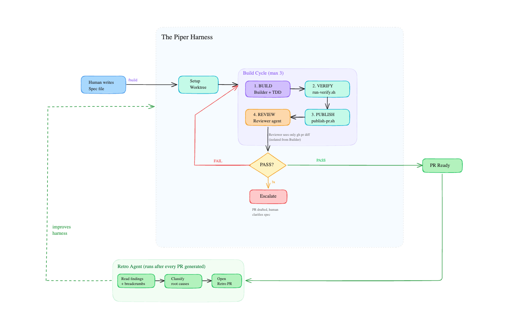

# Piper

> A testbed for our Claude Code agent harness, built around a real, working app.

## What this repo is

This project has two purposes:

1. **A real iOS app** — Piper bridges authenticated content (starting with X/Twitter articles) into Instapaper. It's a pipe, not a reader.
2. **A harness testbed** — the primary reason this project exists. We used it to build, iterate, and validate our Claude Code agent workflow. The app gave us enough real complexity (SwiftUI, Cloudflare Workers, WKWebView cookie auth) to stress-test the harness without being a toy project.

## The harness



The core philosophy: **humans write intent, agents execute.** A spec file is the only human input. Everything else — worktree creation, TDD, verification, PR creation, review, and retrospective — is automated.

The full workflow is defined in `docs/WORKFLOW.md`. The Claude Code implementation is in `.claude/skills/build/`. Any agent can implement the same workflow by following `WORKFLOW.md` and calling the bash scripts — they are intentionally agent-agnostic.

### The loop

A build is triggered with:

```
/build docs/exec-plans/active/<spec-file>.md
```

Each build runs up to 3 cycles of:

1. **BUILD** — Builder agent reads the spec and codebase, writes tests first (TDD), then implements
2. **VERIFY** — `run-verify.sh` runs type-check, lints, and tests. Builder fixes and retries (max 5) on failure
3. **PUBLISH** — `publish-pr.sh` commits, pushes, and creates or updates the PR
4. **REVIEW** — Reviewer agent reads only `gh pr diff`. Cannot touch code. Checks against core beliefs, layer rules, invariants, and test coverage. Outputs `PASS` or structured `FAIL` findings

Builder and Reviewer are isolated from each other. The Reviewer reads nothing about the codebase except `ARCHITECTURE.md` and `core-beliefs.md` — it only ever sees the diff. This keeps the review honest.

FAIL output is structured:

```
FAIL
architecture/major src/handlers/save.ts:12 -- business logic in router -> move to handler
```

Findings are written to `.cycle-findings.md` in the worktree and fed back to the Builder as the next cycle's input. After 3 cycles without a PASS, `escalate-pr.sh` converts the PR to draft, labels it `escalated`, and posts a structured comment with the full cycle history for a human to resolve.

### The retro agent

After every completed build — pass or fail — the retro agent runs. Its job is to analyze what happened and improve the harness itself.

It reads the cycle findings, the builder's self-reported misses (`.builder-breadcrumbs.md`), and the final PR diff. For each finding it classifies the root cause:

| Category | Fix goes in |
|---|---|
| Spec gap | `_template.md` or spec writing guidance |
| Builder blind spot | `builder.md` |
| Reviewer miss | `reviewer.md` |
| Linter gap | `run-verify.sh` or a new script |
| Script bug | the specific script |
| Infra gap | `SKILL.md` |

It then opens its own PR (branched from `origin/main`, never from the feature branch) containing the retrospective doc at `docs/retros/<feature-name>.md` and any concrete harness edits. Every proposed change must reference a specific file and a specific root cause — no speculative improvements.

It also checks `docs/retros/` for recurring patterns. The same finding appearing across multiple retros gets escalated in severity.

A 1-cycle clean build still gets a retro. Short and honest beats long and padded.

### Scripts

All scripts are plain bash and live in `.claude/scripts/`:

| Script | Purpose |
|---|---|
| `create-worktree.sh <branch>` | Creates isolated git worktree — main is never touched during a build |
| `run-verify.sh <worktree-path>` | Type-check, lints, tests. Exits 0 on pass, 1 on fail |
| `publish-pr.sh <worktree> <branch> <name> <spec>` | Commits, pushes, creates/updates PR |
| `escalate-pr.sh <pr-number> <findings-file>` | Drafts PR, labels it, posts escalation comment |

## What Piper does

Instapaper can't read paywalled or authenticated content. Piper fixes that:

1. Log into X once inside the app — cookies stored on-device
2. Copy an article URL from X
3. Open Piper — it reads the URL from clipboard, loads it in a hidden WKWebView using your cookies, extracts clean article HTML via readability.js
4. Content is posted to a Cloudflare Worker, stored under a random UUID for 1 hour
5. UUID URL lands on your clipboard — paste it into Instapaper and save normally

No accounts. No servers that know who you are. Content expires after 1 hour by design.

## Stack

| Layer | Tech |
|---|---|
| iOS | Swift, SwiftUI, WKWebView |
| Backend | Cloudflare Worker (TypeScript), Cloudflare KV |
| Content extraction | readability.js (injected into WKWebView) |

## Repo layout

```
piper/
├── backend/           Cloudflare Worker
├── ios/               Xcode project
├── docs/
│   ├── WORKFLOW.md    canonical harness workflow
│   ├── retros/        retrospective docs from each build
│   ├── BACKEND.md
│   └── IOS.md
├── .claude/
│   ├── skills/build/  Claude Code implementation of the harness
│   └── scripts/       Agent-agnostic bash scripts
└── AGENTS.md          Invariants and orientation for any agent
```

## Getting started

### Backend

```bash
cd backend
npm install
npm run dev   # wrangler dev
```

### iOS

Open `ios/Piper/Piper.xcodeproj` in Xcode. No entitlements or App Group configuration required. See `ios/SETUP.md` for details.
